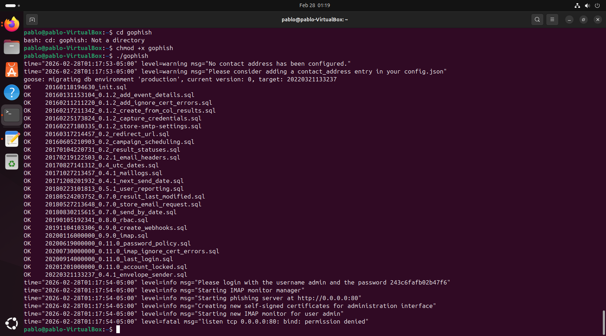
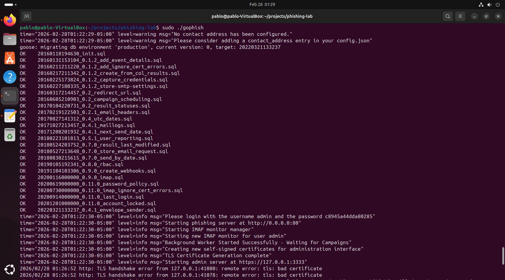
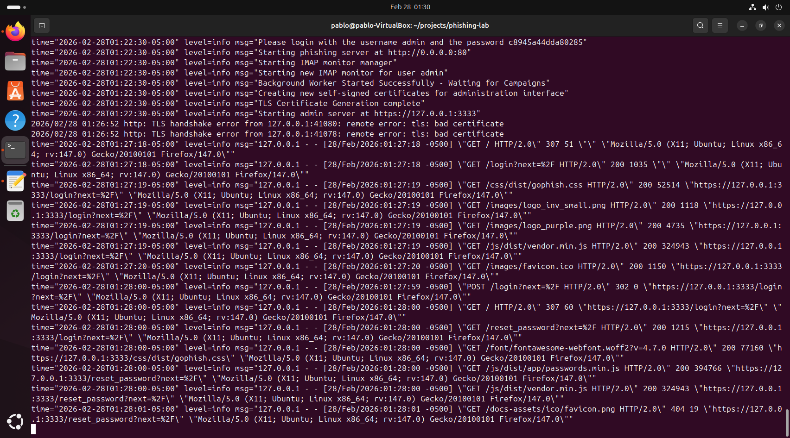
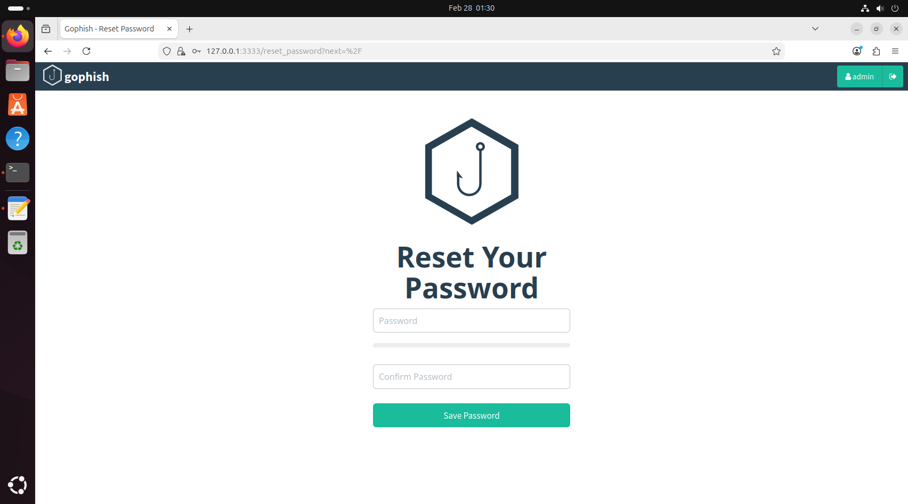
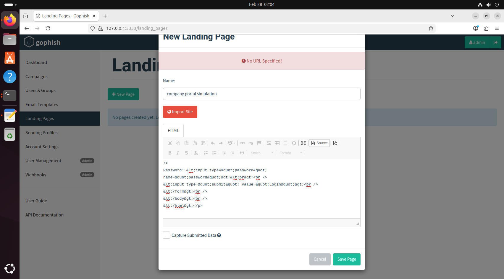
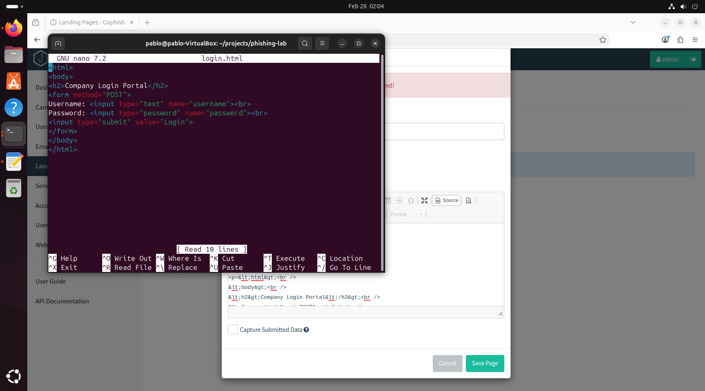
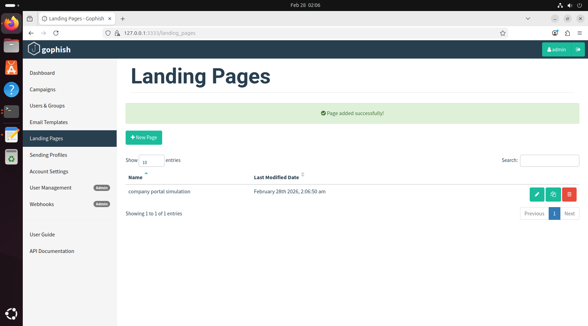
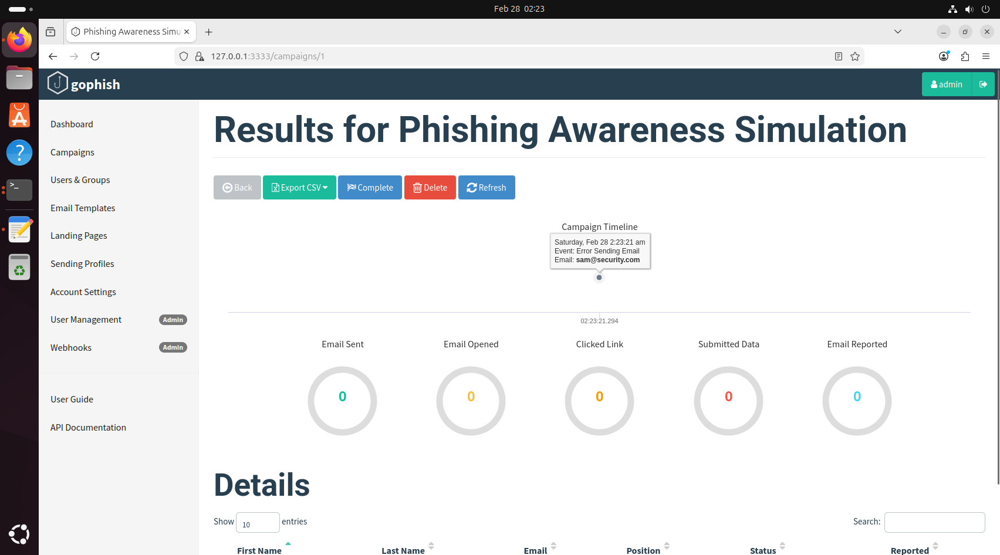
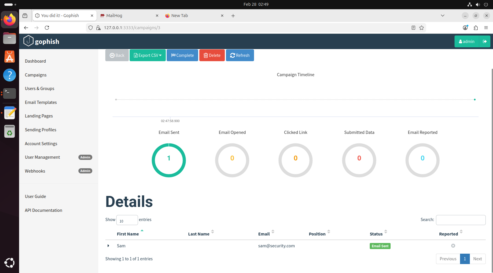

# Phishing Simulation Lab (Gophish on Ubuntu)

## Overview
This project demonstrates a controlled phishing simulation using GoPhish in a local Ubuntu lab environment.
The goal was to understand how phishing campaigns are configured, how landing pages capture input, and how campaign metric can be used to measure user interaction for security awareness training.

> **Note:** This was performed in a safe, isolated lab for educational purposes only.

---

## Lab Environment
- Ubuntu VM
- Gophish v0.12.1
- Custom HTML landing page (`login.html`)

---
## project Walkthrough

### 1) Install & Launch GoPhish
GoPhish was installed and started locally. Admin interface was available at `https://127.0.0.1:3333`.

---

### 2) Access Admin Dashboard
Logged into the GoPhish admin portal and validated the environment was running correctly.

---

### 3) Create a Landing page (Credential Harvest Simulation)
A simple HTML login portal was created and imported as a GoPhish landing page. 

- File: `login.html`
- purpose: simulate a credential submission workflow (lab only)

---

### 4) Create Email Template
a phishing email template was configuired to direct the target to the landing page.

---

### 5) Configure Sending Profile & Target Group
A sending profile and target group were created for test delivery in the lab. 

---

### 6) launch Campaign & review Metrics
A campaign was launch to a test target and GoPhish analytics were review (sent/clicked/submitted data).

---

### Skills Demonstrated
-Linux Administration (Ubuntu CLI)
-Phishing simulation tooling (GoPhish)
-Landing page create/import (HTML)
-Campaign configuration (templates, sending profile, target groups)
-Awareness metrics interpretation (delivery, click, submit)

---

## Disclaimer
This repository is for **educational and defensive security training** only.
Do not use these techniques on real users, systems, or network without explicit written permission.
